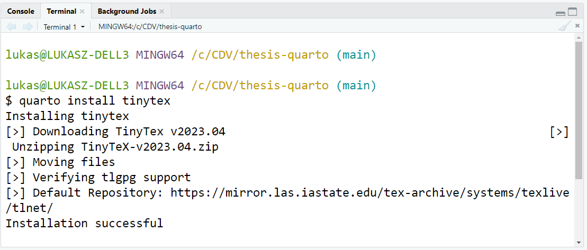

# thesis-quarto

Example of thesis in quarto

1. Install quarto

2. In terminal `quarto install tinytex`

3. Check TinyTex\bin path

https://github.com/quarto-dev/quarto-cli/issues/4908#issuecomment-1478633054

4. Render
